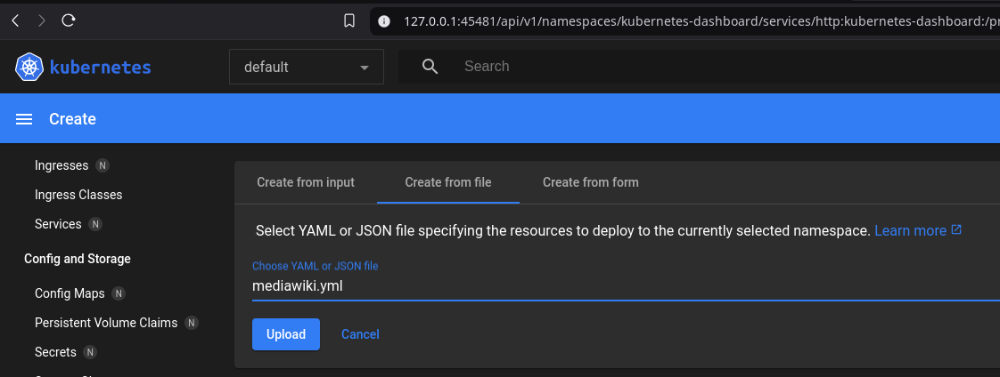
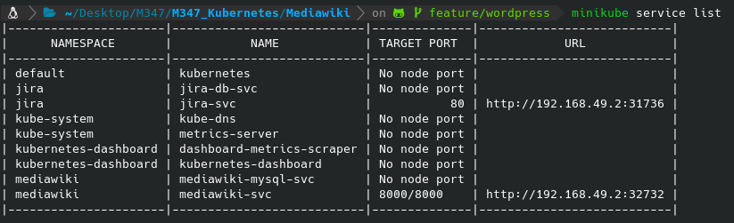
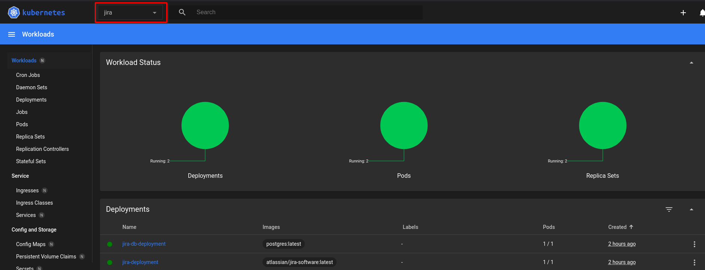

# Dokumentation für das Projekt "Kubernetes"


## Einleitung
Dieses Projekt stellt eine Dokumentation für die Verwendung von Kubernetes bereit. Es wird auf die Installation, Konfiguration und Verwendung von Kubernetes eingegangen. In diesem Projekt werden die folgenden Beispielanwendungen verwendet:
- [MediaWiki](https://www.mediawiki.org/wiki/MediaWiki)
- [Jira](https://www.atlassian.com/software/jira)
- [WordPress](https://wordpress.org/)

## Inhaltsverzeichnis
- [Dokumentation für das Projekt "Kubernetes"](#dokumentation-für-das-projekt-kubernetes)
  - [Einleitung](#einleitung)
  - [Inhaltsverzeichnis](#inhaltsverzeichnis)
  - [Installation der benötigten Software](#installation-der-benötigten-software)
    - [Docker](#docker)
    - [Minikube](#minikube)
    - [Kubectl](#kubectl)
  - [Vorbereitungen für die Verwendung von Kubernetes](#vorbereitungen-für-die-verwendung-von-kubernetes)
    - [Docker starten](#docker-starten)
    - [Minikube starten](#minikube-starten)
    - [Minikube Dashboard](#minikube-dashboard)
  - [Sicherheit](#sicherheit)
  - [Herunterladen und Starten der Beispielanwendungen](#herunterladen-und-starten-der-beispielanwendungen)
    - [Klonen des Repositories](#klonen-des-repositories)
    - [Anwenden der Beispielanwendungen über die Befehlszeile](#anwenden-der-beispielanwendungen-über-die-befehlszeile)
    - [Anwenden der Beispielanwendungen über das Minikube-Dashboard](#anwenden-der-beispielanwendungen-über-das-minikube-dashboard)
    - [Öffnen der Beispielanwendungen](#öffnen-der-beispielanwendungen)
    - [Konfiguration der Beispielanwendungen](#konfiguration-der-beispielanwendungen)
  - [Detailierte Dokumentationen der Beispielanwendungen](#detailierte-dokumentationen-der-beispielanwendungen)
  - [Designentscheidungen](#designentscheidungen)
    - [Namespace](#namespace)
  - [Fazit](#fazit)
  - [Generelle Hilfen welche verwendet wurden](#generelle-hilfen-welche-verwendet-wurden)


## Installation der benötigten Software

### Docker
Kubernetes verwendet im Hintergrund eine Virtualisierungssoftware, um Container zu erstellen und zu verwalten. Die bekannteste Software für die Virtualisierung von Containern ist Docker. Aus haben wir uns persönlich für die Verwendung von Docker entschieden. Für die Installation, verwenden Sie die offiziele Dokumentation [Docker-Dokumentation](https://docs.docker.com/get-docker/). Hier wird die Installation für verschiedene Betriebssysteme beschrieben.

### Minikube
Minikube ist ein Tool, das es ermöglicht, ein Kubernetes-Cluster auf einem einzelnen Computer zu erstellen. Für die Installation, verwenden Sie die offiziele Dokumentation [Minikube-Dokumentation](https://minikube.sigs.k8s.io/docs/start/).

### Kubectl
Kubectl ist ein Befehlszeilentool, das es ermöglicht, mit einem Kubernetes-Cluster zu interagieren. Für die Installation, verwenden Sie die offiziele Dokumentation [Kubectl-Dokumentation](https://kubernetes.io/docs/tasks/tools/install-kubectl/).


## Vorbereitungen für die Verwendung von Kubernetes
Nach der Installation von Docker, Minikube und Kubectl müssen einige Vorbereitungen getroffen werden, um Kubernetes verwenden zu können. Dazu gehören die folgenden Schritte:

### Docker starten
Bevor Minikube gestartet werden kann, muss Docker gestartet werden. Dazu kann das Docker-Desktop-Tool verwendet werden, falls Sie Docker auf einem Windows- oder Mac-Computer installiert haben. Auf einem Linux-Computer kann Docker über die Befehlszeile gestartet werden.

### Minikube starten
Starten Sie Minikube mit dem folgenden Befehl:
```bash
minikube start
```

### Minikube Dashboard
Nachdem Minikube gestartet wurde, können Sie das Minikube-Dashboard mit dem folgenden Befehl öffnen:
```bash
minikube dashboard
```

Das Minikube-Dashboard zeigt Ihnen eine Übersicht über den Status Ihres Kubernetes-Clusters und ermöglicht es Ihnen, verschiedene Aktionen wie das Erstellen von Pods, Deployments und Services durchzuführen.

## Sicherheit
Kubernetes ist ein mächtiges Werkzeug zur Verwaltung von Containern, aber es ist auch wichtig, die Sicherheit zu berücksichtigen. In diesem Projekt haben wir die folgenden Sicherheitsmaßnahmen getroffen:
- Verwendung von Namespaces zur Isolierung von Anwendungen
- Verwendung von ConfigMaps und Secrets zur Speicherung von sensiblen Informationen

Falls Sie also andere Datenbank Psswörter oder der gleichen verwenden möchten, können Sie diese in den bestehenden Manifesten anpassen.
**Wichtig:** Die Werte, welche im Secret definiert werden, müssen Base64 kodiert sein. Was Sie mit dem folgenden Command in Ihrem Terminal erreichen können:
```bash
echo -n 'IhrPasswort' | base64
```


## Herunterladen und Starten der Beispielanwendungen
Die Beispielanwendunen können aus diesem Repository heruntergeladen werden. Dazu können Sie das Repository klonen oder die einzelnen Dateien herunterladen. Die Beispielanwendungen sind in YAML-Dateien definiert, die Sie mit Kubectl auf Ihrem Kubernetes-Cluster anwenden können.
Für die Verwendung können Sie auch das Minikube-Dashboard verwenden, um die Beispielanwendungen zu erstellen und zu verwalten.

### Klonen des Repositories
```bash
git clone https://github.com/CKnuchel/M347_Kubernetes.git
```

### Anwenden der Beispielanwendungen über die Befehlszeile
```bash
cd M347_Kubernetes
kubectl apply -f mediawiki.yaml
```

### Anwenden der Beispielanwendungen über das Minikube-Dashboard
Öffnen Sie das Minikube-Dashboard und navigieren Sie zu "Workloads" -> "Deployments". Klicken Sie auf "Create" und wählen Sie die YAML-Datei aus, die Sie anwenden möchten. Klicken Sie auf "Create" und die Beispielanwendung wird auf Ihrem Kubernetes-Cluster erstellt.



### Öffnen der Beispielanwendungen
Nachdem Sie die Beispielanwendungen angewendet haben, können Sie mit dem Befehl `kubectl get pods` den Status der Pods überprüfen und mit dem Befehl `minikube service list` die Services anzeigen.

Die Ausgabe der Services zeigt Ihnen die IP-Adresse und den Port, unter dem Sie auf die Beispielanwendungen zugreifen können. Sie können dann mit Ihrem Webbrowser auf die Beispielanwendungen zugreifen und diese verwenden.



### Konfiguration der Beispielanwendungen
Alle Anwendungen müssen im Anschluss in dem Webbrowser konfiguriert werden. Hierzu müssen Sie die IP-Adresse und den Port des Services in die Adresszeile des Browsers eingeben. Die Konfiguration der Anwendungen erfolgt über ein Webinterface, das Ihnen Schritt für Schritt durch die Konfiguration führt.

Die Dokumentation für die Konfiguration der Beispielanwendungen finden Sie hier:
- [MediaWiki](./Mediawiki/README.md#installationsanleitung)
- [Jira](./Jira/README.md#installationsanleitung)
- [Wordpress](./Wordpress/README.md#installationsanleitung)

## Detailierte Dokumentationen der Beispielanwendungen
- [MediaWiki](./Mediawiki/README.md)
- [Jira](./Jira/README.md)
- [Wordpress](./Wordpress/README.md)

## Designentscheidungen
In diesem Projekt haben wir uns für die Verwendung von Docker, Minikube und Kubectl entschieden, da diese Tools weit verbreitet und gut dokumentiert sind. Wir haben uns auch für die Verwendung von YAML-Dateien zur Definition der Beispielanwendungen entschieden, da YAML eine einfache und lesbare Sprache ist, die es ermöglicht, komplexe Konfigurationen zu definieren.

Für die Definition der Manifeste, hatten wir die Möglichkeiten diese in einer Datei zu definieren oder in mehreren Dateien. Wir haben uns für die Variante entschieden, die Manifeste in einer Datei zu definieren, da dies übersichtlicher ist und es einfacher macht, die Konfiguration zu verwalten.

### Namespace
Da wir mehrere Anwendungen haben, die auf demselben Kubernetes-Cluster laufen, haben wir uns entschieden, für jede Anwendung einen eigenen Namespace zu erstellen. Dies ermöglicht es uns, die Anwendungen voneinander zu isolieren und die Ressourcen für jede Anwendung getrennt zu verwalten. Ebenso können wir die Anwendungen einfacher überwachen und verwalten.

Die Anzeige im Minikube-Dashboard wird dadurch übersichtlicher und wir können die Anwendungen einfacher identifizieren und verwalten. Da wir den Namespace einfach auf dem Dashboard auswählen können, können wir die Anwendungen schnell und einfach überwachen und verwalten.



## Fazit
In diesem Projekt haben wir die Installation, Konfiguration und Verwendung von Kubernetes dokumentiert. Wir haben die Beispielanwendungen MediaWiki, Jira und WordPress auf einem Kubernetes-Cluster erstellt und konfiguriert. Wir haben die Designentscheidungen erläutert, die wir bei der Erstellung der Beispielanwendungen getroffen haben, und die Vorteile der Verwendung von Docker, Minikube und Kubectl hervorgehoben.

Durch dieses Projekt konnten wir die Verwendung von Kubernetes besser verstehen und die Vorteile von Containervirtualisierung und Orchestrierung von Containern kennenlernen. Wir haben gelernt, wie Kubernetes verwendet werden kann, um Anwendungen auf einem Cluster von Containern zu erstellen und zu verwalten, und wie es uns ermöglicht, Anwendungen skalierbar und zuverlässig bereitzustellen.

## Generelle Hilfen welche verwendet wurden
- [Offiziele Kubernetes Dokumentation](https://kubernetes.io/docs/home/)
- [Kubernestes Stateful Application](https://kubernetes.io/docs/tutorials/stateful-application/)
- [Kubernetes Guide für Wordpress](https://kubernetes.io/docs/tutorials/stateful-application/mysql-wordpress-persistent-volume/)
- [Docker Hub - MediaWiki](https://hub.docker.com/_/mediawiki)
- [Docker Hub - Jira](https://hub.docker.com/r/atlassian/jira-software)
- [Docker Hub - Wordpress](https://hub.docker.com/_/wordpress)